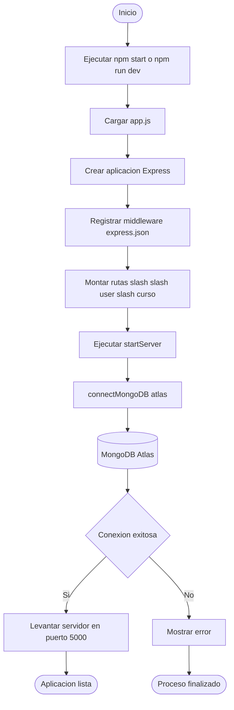
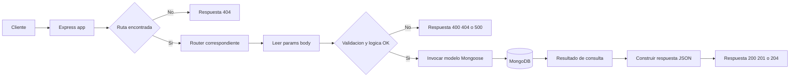
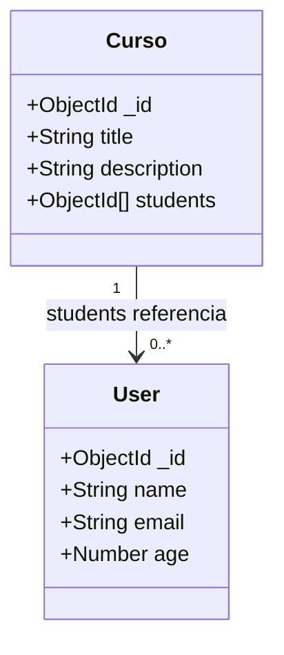
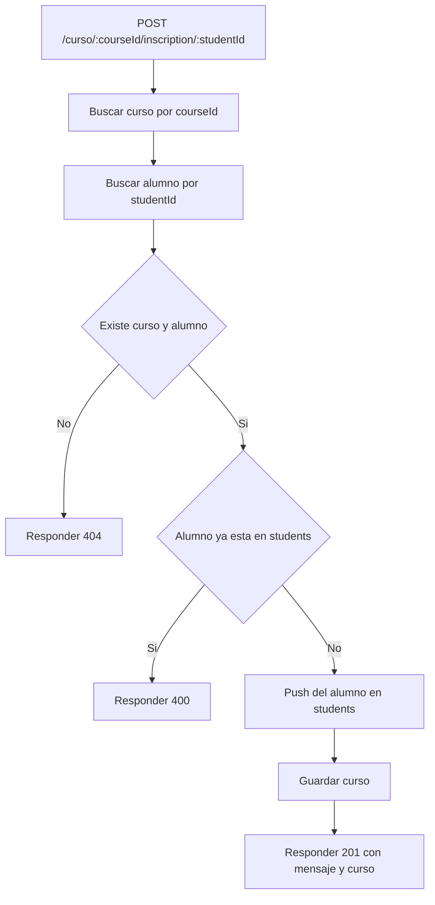
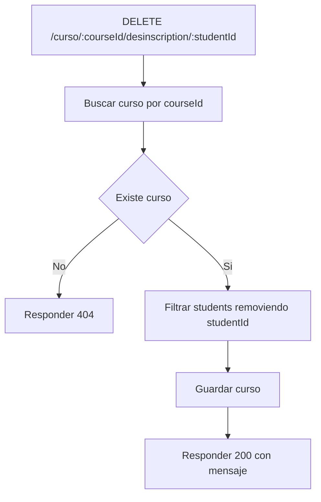

# Backend 76800

API REST construida con **Express + Mongoose** para gestionar:

- usuarios
- cursos
- inscripción y desinscripción de alumnos en cursos

## Objetivo del proyecto

El proyecto implementa un backend simple orientado a práctica de CRUD y relaciones en MongoDB, usando una arquitectura modular por rutas.

## Stack tecnológico

- **Node.js** (ES Modules)
- **Express 5**
- **Mongoose 9**
- **MongoDB** (Atlas o local)
- **Nodemon** (entorno de desarrollo)

## Estructura actual del proyecto

```text
be_76800/
|- app.js
|- package.json
|- package-lock.json
|- README.md
|- .gitignore
|- atlas.txt
|- config/
|  |- db/
|  |  |- connect.config.js
|  |- models/
|     |- User.model.js
|     |- Curso.model.js
|- routes/
|  |- home.router.js
|  |- user.router.js
|  |- courses.router.js
|- postman/
   |- Users.postman_collection.json
   |- Curso.postman_collection.json
   |- Productos.postman_collection.json
```

## Arquitectura

Arquitectura monolítica modular, separada por responsabilidades:

- `app.js`: composición de la app, middlewares globales, montaje de rutas y arranque del servidor.
- `routes/*.router.js`: capa HTTP (endpoints, validaciones básicas, respuestas).
- `config/models/*.model.js`: capa de datos (schemas y modelos de Mongoose).
- `config/db/connect.config.js`: conexión a MongoDB y selección de entorno (`local` o `atlas`).

No hay capa de controllers/services separada: la lógica de negocio vive en cada router.

## Flujo completo de arranque



## Flujo completo de una request



## Modelo de datos



### `User` (`config/models/User.model.js`)

Campos:

- `name` (String, requerido)
- `email` (String, requerido, único)
- `age` (Number, requerido)

### `Curso` (`config/models/Curso.model.js`)

Campos:

- `title` (String, requerido, indexado)
- `description` (String, opcional)
- `students` (Array de `ObjectId`, referencia a usuario)

## Endpoints y métodos

Base URL local: `http://localhost:5000`

### Salud/Home

- `GET /`
  - Respuesta: `200` `{ "title": "Bienvenidos" }`

### Usuarios (`/user`)

- `GET /user`
  - Lista todos los usuarios.
  - Respuesta: `200` `{ users: [...] }`

- `POST /user`
  - Crea usuario.
  - Body requerido:

    ```json
    {
      "name": "Ada",
      "email": "ada@mail.com",
      "age": 30
    }
    ```

  - Respuestas:
    - `201` usuario creado
    - `400` si faltan campos
    - `500` error interno o duplicado de email

- `GET /user/:id`
  - Busca usuario por ObjectId.
  - Respuestas:
    - `200` usuario
    - `400` id inválido
    - `404` no encontrado

- `PUT /user/:id`
  - Actualiza usuario por id.
  - Usa `runValidators: true`.
  - Respuestas:
    - `200` actualizado
    - `400` id inválido
    - `404` no encontrado

- `DELETE /user/:id`
  - Elimina usuario por id.
  - Respuestas:
    - `204` eliminado sin contenido
    - `400` id inválido
    - `404` no encontrado

### Cursos (`/curso`)

- `GET /curso`
  - Lista todos los cursos.
  - Respuesta: `200` `{ cursos: [...] }`

- `POST /curso`
  - Crea curso.
  - Body ejemplo:

    ```json
    {
      "title": "Backend Avanzado",
      "description": "Node, Express y MongoDB"
    }
    ```

  - Respuestas:
    - `201` curso creado
    - `500` error de validación/servidor

- `POST /curso/:courseId/inscription/:studentId`
  - Inscribe un alumno en el curso.
  - Flujo:
    1. Busca curso.
    2. Busca alumno.
    3. Verifica existencia de ambos.
    4. Verifica que no esté ya inscripto.
    5. Agrega `studentId` a `students` y guarda.
  - Respuestas:
    - `201` inscripción exitosa
    - `400` alumno ya inscripto
    - `404` curso o alumno no encontrado
    - `500` error interno

- `DELETE /curso/:courseId/desinscription/:studentId`
  - Desinscribe alumno del curso.
  - Elimina el `studentId` del array `students`.
  - Respuestas:
    - `200` desinscripción exitosa
    - `404` curso no encontrado
    - `500` error interno

- `DELETE /curso/:courseId`
  - Elimina un curso.
  - Respuestas:
    - `204` eliminado
    - `404` curso no encontrado
    - `500` error interno

### Fallback 404 global

Cualquier ruta no definida responde:

- `404` `{ "title": "404 - Página no encontrada!" }`

## Flujo de inscripcion



## Flujo de desinscripcion



## Configuración y ejecución

### 1. Instalar dependencias

```bash
npm install
```

### 2. Ejecutar en desarrollo

```bash
npm run dev
```

### 3. Ejecutar en producción

```bash
npm start
```

Servidor por defecto:

- `http://localhost:5000`

## Conexión a MongoDB

Archivo: `config/db/connect.config.js`

- `connectMongoDB('atlas')` en `app.js` conecta a Atlas.
- Si querés local, cambiar a `connectMongoDB('local')`.

Detalle importante implementado:

- Se fijan DNS públicos en Node para evitar errores SRV intermitentes con algunos ISP:
  - `8.8.8.8`
  - `1.1.1.1`

## Colecciones de Postman

Dentro de `postman/` ya hay colecciones para probar endpoints:

- `Users.postman_collection.json`
- `Curso.postman_collection.json`
- `Productos.postman_collection.json`

## Códigos HTTP usados

- `200` OK
- `201` Created
- `204` No Content
- `400` Bad Request
- `404` Not Found
- `500` Internal Server Error

## Observaciones técnicas

- Actualmente las credenciales de MongoDB están hardcodeadas. Recomendado mover a variables de entorno (`.env`).
- No hay capa de tests automatizados todavía.
- El proyecto mantiene un diseño simple y directo para aprendizaje y evolución incremental.
